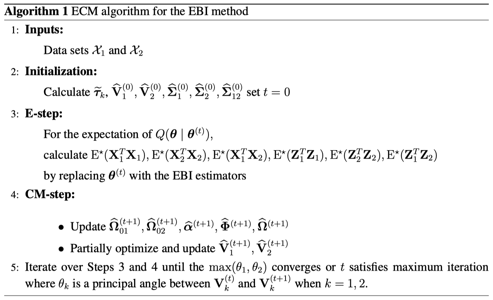
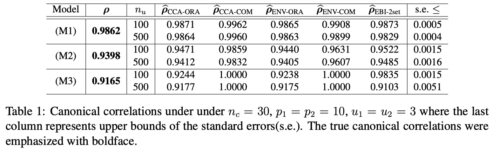
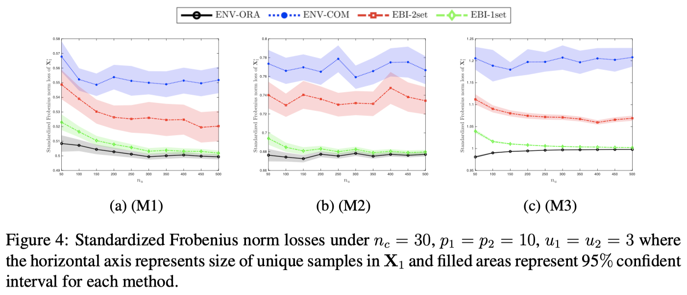
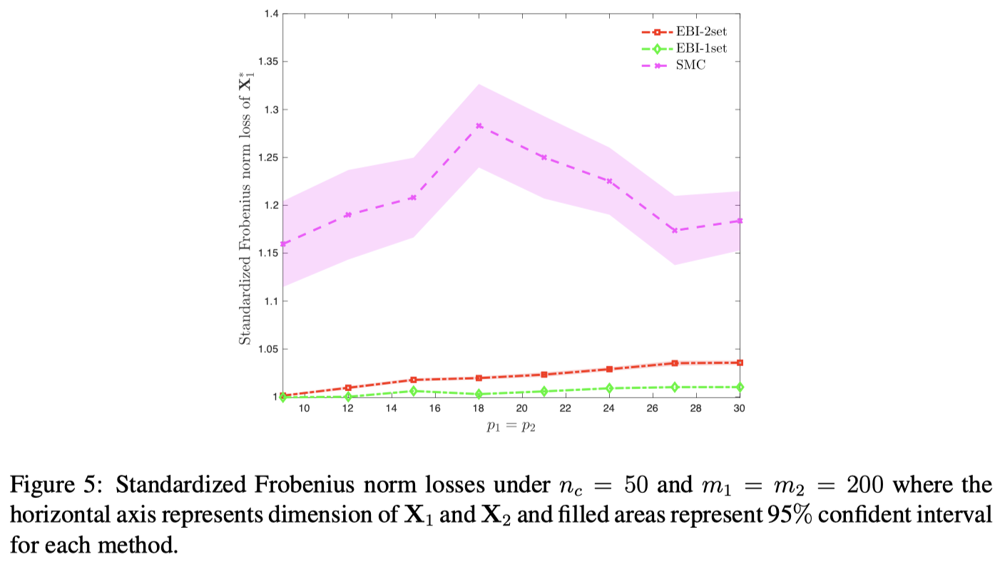
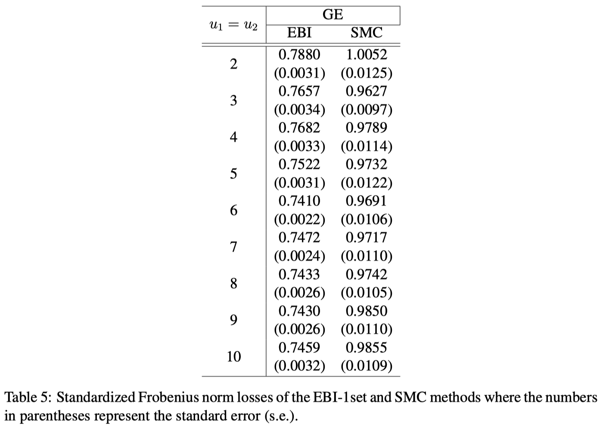
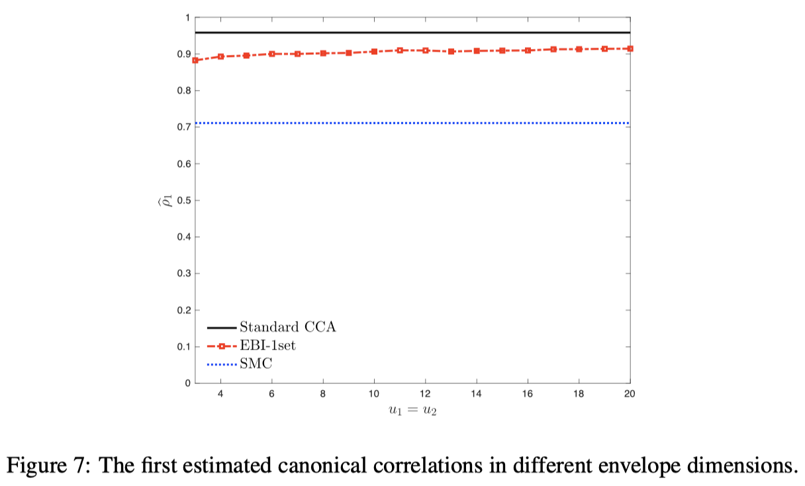

## **Motivation**

* Integrating information from multiple sources of the same observation is one way to ensure the power of the analysis under cost constraints. 
* In the case of the data integration, the small overlapped observations may hinder the feasibility of such integrative analysis. 
* Matrix completion can be considered to a problem of a missing imputation.
* We proposed a **multiple block-wise matrix completion method** so called "Envelope Block-wise Imputation (**EBI**)".

## **Envelope method**

The Envelope method proposed on the context of the multivariate linear model with a view toward prediction and coefficient estimation. 
* By using a material variation provides information that is directly relevant to the regression, 
* while the immaterial variation is essentially irrelevant to the regression and serves to increase estimative variation.
* A **simultaneous envelope method** proposed for joint reduction of the responses and predictors.
* The method is simultaneously separating the material and immaterial variation in the responses and in the predictors.

## **Envelope Blockwise Imputation (EBI) method**

### Block-wise missing structure

Assume that two data sets are partially overlapped into the common samples where
* Common part: $\mathbf{X}_{k}^{c}, \enspace k=1,2$, 
* Unique part: $\hspace{0.8em} \textbf{X}_{k}^{u}, \enspace k=1,2$,
* Missing part: $\hspace{0.45em} \textbf{X}_{k}^{\star}, \enspace k=1,2$.

The block-wise missing structure is displayed in the first figure on this page.

### ECM algorithm

We apply Expectation Conditional-Maximization (ECM) algorithm to update our parameters under the Simultaneous Envelope structure as follows. 

* First, **initiate** the envelope parameters from the overlapped (common) samples.
* Next, calculate expected values of the missing parts with unique and common samples (**E-step**).
* Lastly, update the envelope parameters in **CM-step** until convergence.

We assume normality on the data sets for m.l.e. derivations.

### Simulation results

For comparison, we use six different methods including the EBI method.
* “**CCA**” uses a standard canonical correlation analysis (CCA) method.
* “**ENV**” uses the simultaneous envelope method to estimate canonical correlations, corresponding directions, and regression coefficients.
* “**ORA**” means that we use an oracle data set that has all samples without any missing parts. Thus, the “ORA” estimator could be judged as an ideal case.
* “**COM**” estimator means we only use common samples to estimate the canonical estimators.
* “**EBI-2set**” uses the proposed EBI method on two block-wise missing data sets.

Also, we use three different scenarios for the covariance structures.
* "**M1**" assumes identity structures
* "**M2**" assumes general covariance structures (which have non-overlapping eigen-values on matrix decomposition)
* "**M3**" assumes randomly generated covariance structures

### Real data analysis

